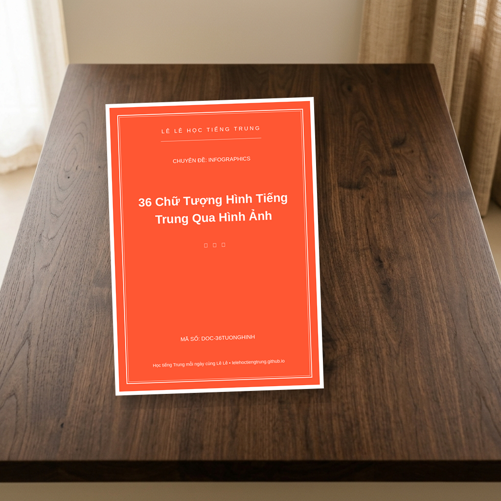

# 36 Chữ Tượng Hình Tiếng Trung Qua Hình Ảnh
**ID/SKU**: DOC-36TUONGHINH
**Phù hợp với**: Người mới bắt đầu học tiếng Trung | Trẻ em học tiếng Trung | Giáo viên cần học liệu trực quan để giảng dạy

## Giới thiệu tài liệu:
## Chào các bạn! Lê Lê đây! 👋

Rất vui được gặp lại mọi người trong chuyên mục chia sẻ tài liệu xịn xò của kênh **"Lê Lê học tiếng Trung"**! Hôm nay, Lê Lê mang đến cho các bạn một món quà cực kỳ đặc biệt, đảm bảo sẽ giúp việc học chữ Hán của bạn trở nên thú vị hơn bao giờ hết. Đó chính là bộ tài liệu: **36 Chữ Tượng Hình Tiếng Trung Qua Hình Ảnh**. ✨

Bạn có bao giờ cảm thấy chữ Hán thật khó nhớ với những nét gạch chồng chéo không? Đừng lo nhé! Tiếng Trung thực chất bắt nguồn từ những hình vẽ mô phỏng sự vật trong đời sống. Khi chúng ta hiểu được nguồn gốc hình thành của chữ, việc ghi nhớ sẽ trở nên cực kỳ đơn giản và khắc sâu vào bộ não luôn đó!

### 💎 Tài liệu này có gì đặc biệt?
Bộ Infographics này được thiết kế tỉ mỉ, giúp bạn kết nối thị giác giữa hình ảnh thực tế và mặt chữ Hán hiện đại. 
- **Trực quan sinh động:** Mỗi chữ Hán được minh họa bằng một bức tranh màu sắc, giúp bạn "nhìn hình đoán chữ" ngay lập tức.
- **Dễ học, dễ nhớ:** Phù hợp cho cả các bạn nhỏ và những người lớn mới bắt đầu chạm ngõ tiếng Trung.
- **Kích thích tư duy:** Giúp bạn hiểu được ý nghĩa sâu xa đằng sau mỗi nét vẽ của người xưa.

### 📚 Cấu trúc của tài liệu
Tài liệu bao gồm 36 thẻ hình ảnh tương ứng với 36 chữ tượng hình cơ bản nhất (như Nhật, Nguyệt, Sơn, Thủy, Mã, Dương...). Mỗi thẻ bao gồm:
1. **Hình vẽ minh họa:** Mô phỏng sự vật thực tế.
2. **Chữ Hán hiện đại:** Cách viết chuẩn hiện nay.
3. **Phiên âm (Pinyin) và Nghĩa tiếng Việt:** Giúp bạn đọc đúng và hiểu đúng.

### 🖼️ Ảnh minh họa bên trong tài liệu

### ⬇️ Link Download Tài Liệu
Các bạn có thể tải trọn bộ tài liệu sắc nét này tại đây nhé: 
👉 [Link Download Drive](https://drive.google.com/drive/folders/1nZ_rJRny_L99mFM1BumLkEPT2KSOSlZF)

Chúc các bạn học tiếng Trung thật vui và tràn đầy năng lượng cùng Lê Lê nhé! Đừng quên theo dõi kênh để nhận thêm nhiều tài liệu bổ ích nha! ❤️

## Đường dẫn tải tài liệu (Google Drive):
👉 **[Tải xuống PDF 36 Chữ Tượng Hình Tiếng Trung Qua Hình Ảnh](https://drive.google.com/drive/folders/1nZ_rJRny_L99mFM1BumLkEPT2KSOSlZF)**

## Điểm nổi bật (Pros):
- Hình ảnh minh họa cực kỳ sinh động
- Giúp ghi nhớ chữ Hán qua tư duy hình ảnh
- Phù hợp cho trẻ em và người mới bắt đầu
- Thiết kế dạng Infographic hiện đại, dễ nhìn

## Phương pháp học tập (Tips):
- Chỉ bao gồm các chữ tượng hình đơn giản
- Chưa có phần hướng dẫn thứ tự các nét viết chi tiết
