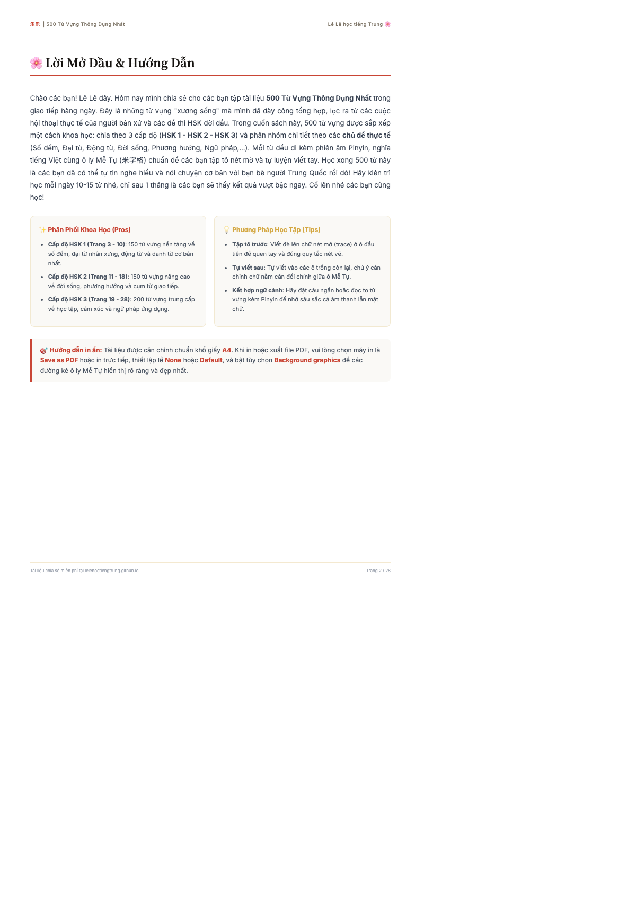
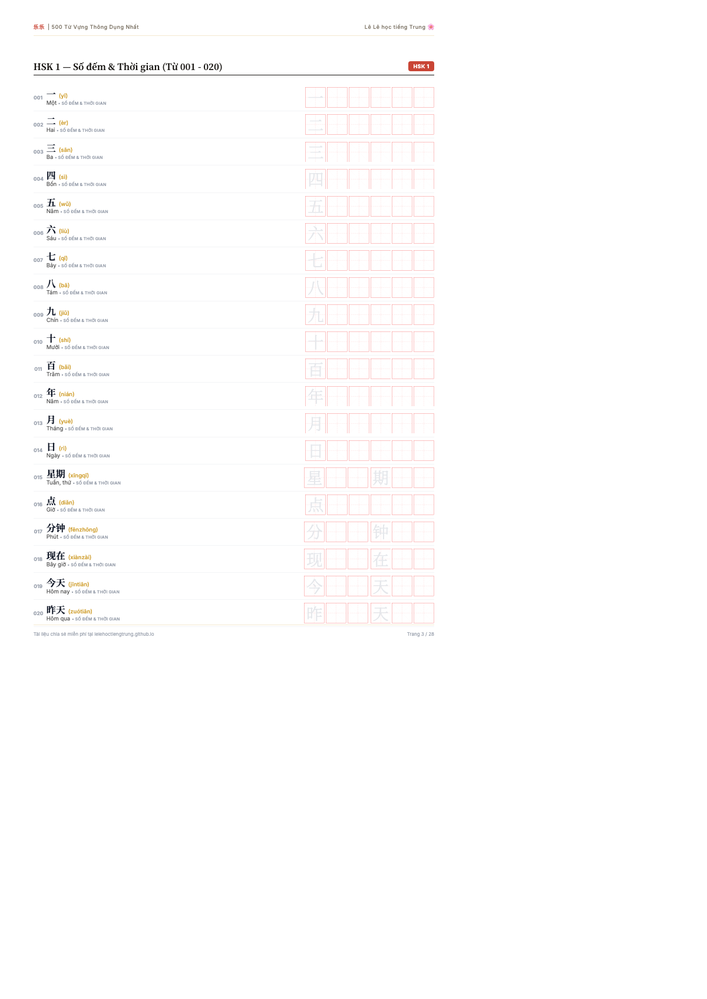

# 500 Từ Vựng Thông Dụng Nhất
**ID/SKU**: DOC-500
**Phù hợp với**: Dành cho các bạn mới bắt đầu học tiếng Trung hoặc đang ôn tập HSK 1-3 cần củng cố vốn từ vựng nền tảng.

## Giới thiệu tài liệu:
Chào các bạn! Lê Lê đây. Hôm nay mình chia sẻ cho các bạn tập tài liệu **500 Từ Vựng Thông Dụng Nhất** trong giao tiếp hàng ngày. Đây là những từ vựng "xương sống" mà mình đã dày công tổng hợp, lọc ra từ các cuộc hội thoại thực tế của người bản xứ và các đề thi HSK đời đầu.

Trong cuốn sách này, 500 từ vựng được sắp xếp một cách khoa học: chia theo 3 cấp độ (**HSK 1 - HSK 2 - HSK 3**) và phân nhóm chi tiết theo các **chủ đề thực tế** (Số đếm, Đại từ, Động từ, Đời sống, Phương hướng, Ngữ pháp,...). Mỗi từ đều đi kèm phiên âm Pinyin chuẩn xác, nghĩa tiếng Việt gần gũi và ô ly Mễ Tự (米字格) chuẩn để các bạn tập tô nét mờ và tự luyện viết tay. Học xong 500 từ này là các bạn đã có thể tự tin nghe hiểu và nói chuyện cơ bản với bạn bè người Trung Quốc rồi đó! Hãy kiên trì học mỗi ngày 10-15 từ nhé, chỉ sau 1 tháng là các bạn sẽ thấy kết quả vượt bậc ngay. Cố lên nhé các bạn cùng học!

## Ảnh minh họa bên trong tài liệu:
Dưới đây là một số hình ảnh thực tế bên trong cuốn tài liệu để các bạn tham khảo:

| Lời mở đầu & Hướng dẫn (Trang 2) | Danh sách từ vựng HSK 1 (Trang 3) |
|:---:|:---:|
|  |  |

## Đường dẫn tải tài liệu (Google Drive):
Các bạn có thể tải bản PDF chất lượng cao để in ấn tại đây:
👉 **[Tải xuống PDF 500 Từ Vựng Thông Dụng Nhất](https://drive.google.com/drive/u/0/folders/1XdzdpnxPyPHp2PnEyIOPUnSwlTcIeTeN)** (Chọn thư mục `DOC-500`)

## Điểm nổi bật (Pros):
- Tổng hợp từ vựng tần suất cao nhất từ thực tế và đề thi.
- Chia theo cấp độ HSK 1 - HSK 2 - HSK 3 rõ ràng.
- Có Pinyin chuẩn, dịch nghĩa dễ hiểu và ô ly Mễ Tự (米字格) tập viết chữ.
- Giao diện thiết kế tối giản, tông màu tối ấm thanh lịch, cực kỳ dễ in ấn học tập.

## Phương pháp học tập (Tips):
- **Tập tô trước**: Viết đè lên chữ nét mờ (trace) ở ô đầu tiên để quen tay và đúng quy tắc nét vẽ.
- **Tự viết sau**: Tự viết vào các ô trống còn lại, chú ý căn chỉnh chữ nằm cân đối chính giữa ô Mễ Tự.
- **Mỗi ngày học 10-15 từ**: Học kiên trì đều đặn thay vì học quá nhiều một lúc.
- **Kết hợp đặt câu**: Ghi âm lại giọng đọc của mình hoặc đặt câu ngắn để nhớ sâu sắc cả âm thanh lẫn mặt chữ.
