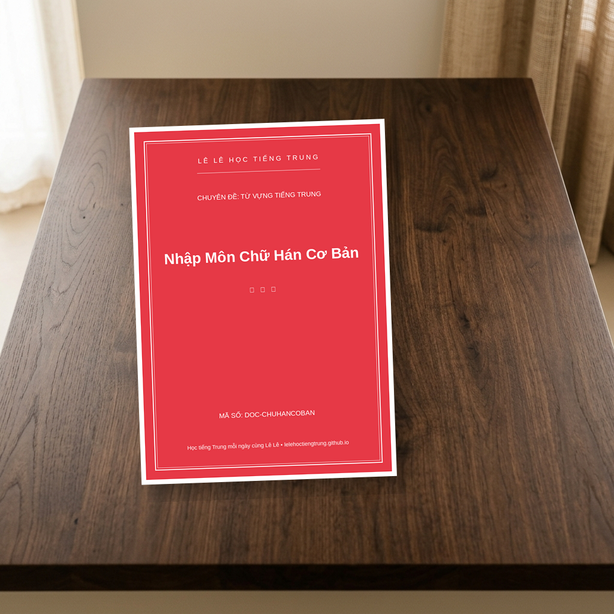

# Nhập Môn Chữ Hán Cơ Bản
**ID/SKU**: DOC-CHUHANCOBAN
**Phù hợp với**: Người mới bắt đầu học tiếng Trung từ con số 0, các bạn nhỏ, hoặc những ai đang cảm thấy "sợ" chữ Hán và muốn tìm một cách tiếp cận thú vị, dễ nhớ hơn.

## Giới thiệu tài liệu:
Chào các bạn! Lê Lê đây! 👋 Chào mừng các bạn đã quay trở lại với góc học tập tràn đầy năng lượng của **Lê Lê học tiếng Trung** nha! 🥰

Các bạn ơi, có phải lúc mới bắt đầu học tiếng Trung, điều khiến chúng mình "đau đầu" nhất chính là **Chữ Hán** không nào? Nhìn những chữ ngoằn ngoèo nhiều nét như những bức tranh trừu tượng chắc hẳn ai cũng từng thấy hoang mang một chút xíu. Nhưng đừng lo nhé, Lê Lê đã mang đến "cứu tinh" cho các bạn đây! Hôm nay, Lê Lê xin giới thiệu tài liệu **"Nhập Môn Chữ Hán Cơ Bản"** – cuốn bí kíp siêu cấp đáng yêu giúp bạn không còn sợ chữ Hán nữa!

---

### 📖 Cấu trúc tài liệu có gì hấp dẫn?

Tài liệu được Lê Lê thiết kế dựa trên phương pháp học chữ Tượng Hình vô cùng sinh động, giúp các bạn bóc tách từng bí mật của chữ Hán cực kỳ dễ nhớ:

1. **Nguồn gốc chữ Hán (Chữ Tượng Hình):** Chúng mình sẽ cùng xem cách người xưa nhìn sự vật ngoài đời thực và "vẽ" lại thành chữ viết như thế nào (ví dụ: chữ Mộc 木 giống cái cây, chữ Sơn 山 giống ngọn núi...).
2. **Các nét cơ bản trong tiếng Trung:** Nắm trọn các nét chấm, ngang, sổ, phẩy, mác... Nền móng có vững thì xây nhà mới cao được, đúng không nào?
3. **Quy tắc bút thuận (Thứ tự nét viết):** Lê Lê đã tổng hợp các quy tắc "thần thánh" như *"Trái trước phải sau"*, *"Trên trước dưới sau"*... giúp bạn viết chữ nào cũng chuẩn, mượt mà và đẹp mắt!
4. **Làm quen với các Bộ Thủ phổ biến:** Những "mảnh ghép Lego" quan trọng nhất để tạo nên hàng ngàn chữ Hán sau này.

---

### 📸 Ảnh minh họa bên trong tài liệu

Để Lê Lê hé lộ một chút xíu "nhan sắc" bên trong của em nó nhé:

*Chữ Hán ban đầu trông như những bức tranh siêu dễ thương!* 

*Phân tích từng nét viết cơ bản cực kỳ trực quan và chi tiết.*

*Áp dụng ngay quy tắc viết để nét chữ luôn mềm mại, chuẩn xác nha!*

---

### 📥 Tải tài liệu ngay thôi nào!

Các bạn đã sẵn sàng chinh phục chữ Hán cùng Lê Lê chưa? Chần chờ gì nữa mà không lưu ngay bảo bối này về máy:

👉 **[TẢI TÀI LIỆU NHẬP MÔN CHỮ HÁN CƠ BẢN TẠI ĐÂY](https://drive.google.com/drive/folders/1ylZl2Ub184W-mZ5QgxAEE0N6dG2988gz)**

Hy vọng tài liệu này sẽ giúp hành trình bắt đầu học tiếng Trung của các bạn trở nên nhẹ nhàng và tràn ngập niềm vui. Tải về nhớ in ra để thực hành nhé. Nếu thấy hiệu quả, đừng quên khoe thành quả nét chữ với Lê Lê nha! Chúc các bạn học tập thật tốt! 加油! ❤️

## Đường dẫn tải tài liệu (Google Drive):
👉 **[Tải xuống PDF Nhập Môn Chữ Hán Cơ Bản](https://drive.google.com/drive/folders/1ylZl2Ub184W-mZ5QgxAEE0N6dG2988gz)**

## Điểm nổi bật (Pros):
- Hình ảnh minh họa sinh động, trực quan
- Giải thích cặn kẽ thứ tự nét viết (bút thuận)
- Phương pháp học qua chữ tượng hình siêu dễ nhớ
- Thiết kế đẹp mắt, rất dễ in ấn ra giấy

## Phương pháp học tập (Tips):
- Chỉ tập trung vào nền tảng vỡ lòng, chưa có nhiều từ ghép phức tạp
- Cần chuẩn bị thêm vở ô li để tự luyện viết tay nhiều lần
