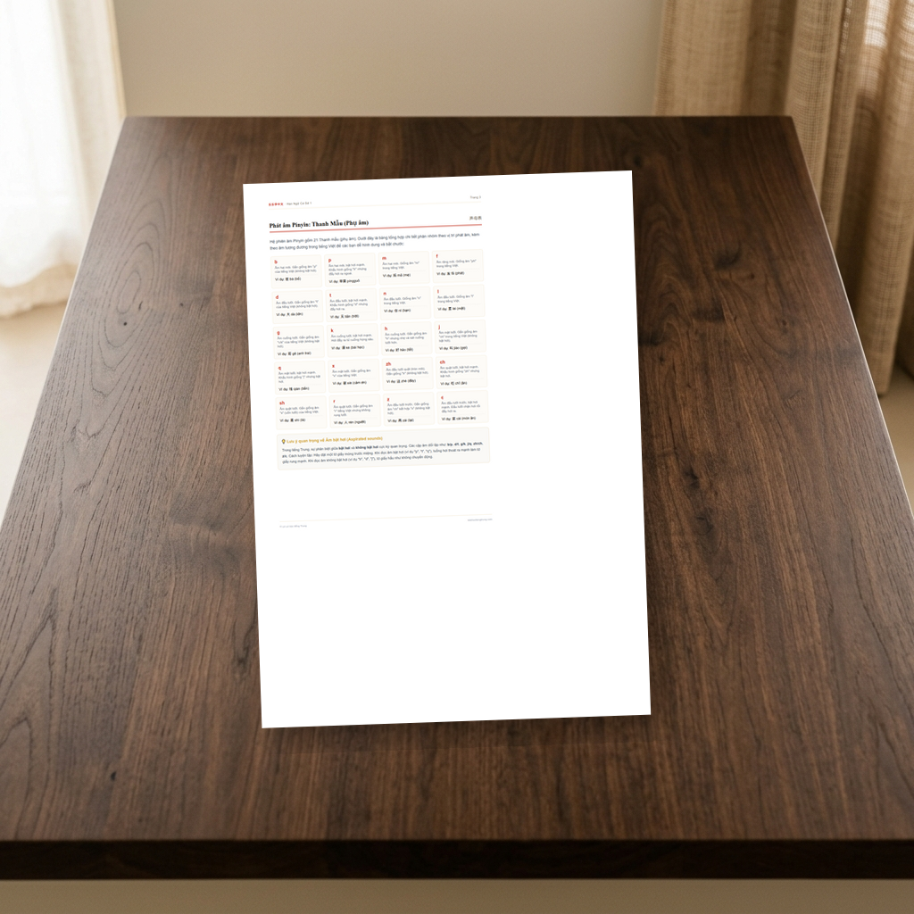
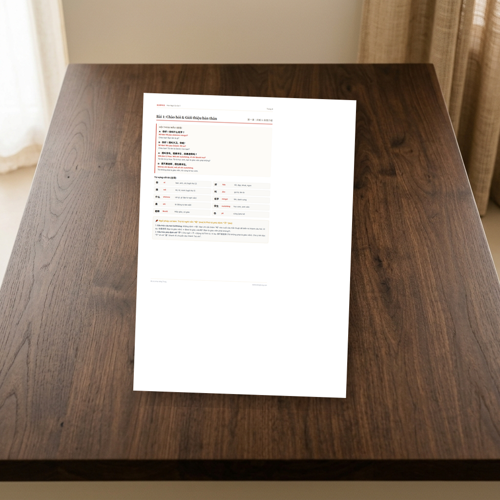

# Hán Ngữ Cơ Sở 1
**ID/SKU**: DOC-COSO1
**Phù hợp với**: Dành cho các bạn mới bắt đầu học tiếng Trung từ con số 0, muốn xây dựng nền tảng vững chắc về phát âm, viết chữ Hán và các mẫu câu giao tiếp cơ bản.

## Giới thiệu tài liệu:
Chào các bạn! Lê Lê đây. Hôm nay mình chia sẻ cho các bạn cuốn cẩm nang **Hán Ngữ Cơ Sở 1**. Đây là cuốn tài liệu "vỡ lòng" do mình đúc kết và tổng hợp lại từ những ngày đầu tiên tiếp xúc với tiếng Trung, được biên soạn vô cùng chi tiết và trực quan để giúp các bạn vượt qua nỗi sợ ban đầu khi đối mặt với một ngôn ngữ tượng hình hoàn toàn mới.

Trong cuốn tài liệu này, các kiến thức nhập môn được phân chia thành 3 phần cực kỳ khoa học:
1. **Hệ thống phát âm Pinyin chuẩn hóa**: Chi tiết 21 Thanh mẫu, 36 Vận mẫu có âm tương đương tiếng Việt gần gũi, kết hợp 4 Thanh điệu chính và các quy tắc biến điệu bắt buộc phải thuộc lòng (như biến điệu của hai thanh 3, biến điệu của "Bất" và "Nhất").
2. **Quy tắc viết chữ Hán cơ bản**: Hướng dẫn cách viết 8 nét cơ bản, 7 quy tắc bút thuận kinh điển kèm ô ly Mễ Tự (米字格) và chữ mẫu nét mờ để các bạn tập tô vẽ, định hình tay viết chuẩn cân đối.
3. **5 bài học giao tiếp thực tế**: Tổng hợp từ vựng, mẫu câu ngữ pháp và đoạn hội thoại ngắn theo các chủ đề gần gũi nhất (Chào hỏi & giới thiệu, Hỏi thăm sức khỏe, Công việc & gia đình, Mua sắm & hỏi giá cả, Hỏi thời gian & ngày tháng).

Học xong tập cẩm nang này, các bạn sẽ tự tin nắm vững 100% nền tảng ngữ âm, quy tắc viết chữ Hán và có phản xạ giao tiếp cơ bản hằng ngày. Hãy kiên trì học tập mỗi ngày một chút nhé! Cố lên nhé các bạn cùng học!

## Ảnh minh họa bên trong tài liệu:
Dưới đây là một số hình ảnh thực tế bên trong cuốn cẩm nang để các bạn tham khảo:

| Thanh mẫu Pinyin & Mẹo phát âm (Trang 3) | Bài học giao tiếp & Từ vựng (Trang 8) |
|:---:|:---:|
|  |  |

## Đường dẫn tải tài liệu (Google Drive):
Các bạn có thể tải bản PDF chất lượng cao để in ấn học tập tại đây:
👉 **[Tải xuống PDF Hán Ngữ Cơ Sở 1](https://drive.google.com/file/d/1Lhsm9Te8njkIGDMFzajOlAgriAFXUm0G/view?usp=sharing)** (Xem trực tiếp hoặc tải xuống từ Google Drive)

## Điểm nổi bật (Pros):
- Trình bày cực kỳ trực quan, khoa học, dễ học cho người tự học từ con số 0.
- Đầy đủ kiến thức nhập môn từ phát âm Pinyin, bút thuận chữ Hán đến giao tiếp cơ bản.
- Có ô ly Mễ Tự (米字格) chuẩn kèm chữ mẫu nét mờ để luyện viết tay dễ dàng.
- Thiết kế tông màu ấm thanh lịch, phông chữ chữ Hán Noto Serif SC siêu đẹp, dễ nhìn, in ấn không lo mỏi mắt.

## Phương pháp học tập (Tips):
- **Luyện cơ miệng trước**: Luyện phát âm đúng khẩu hình theo bảng Thanh mẫu, Vận mẫu trước khi ghép từ.
- **Tập viết đè lên nét mờ**: Tập tô chữ mẫu nét mờ trước để quen tay, sau đó tự viết vào các ô Mễ Tự trống bên cạnh.
- **Shadowing hội thoại**: Đọc to thành tiếng các đoạn hội thoại mẫu, nhại giọng lại để luyện phản xạ nói tự nhiên nhất.
- **Học kiên trì hằng ngày**: Dành 15-20 phút đều đặn mỗi ngày thay vì học dồn vào cuối tuần.
