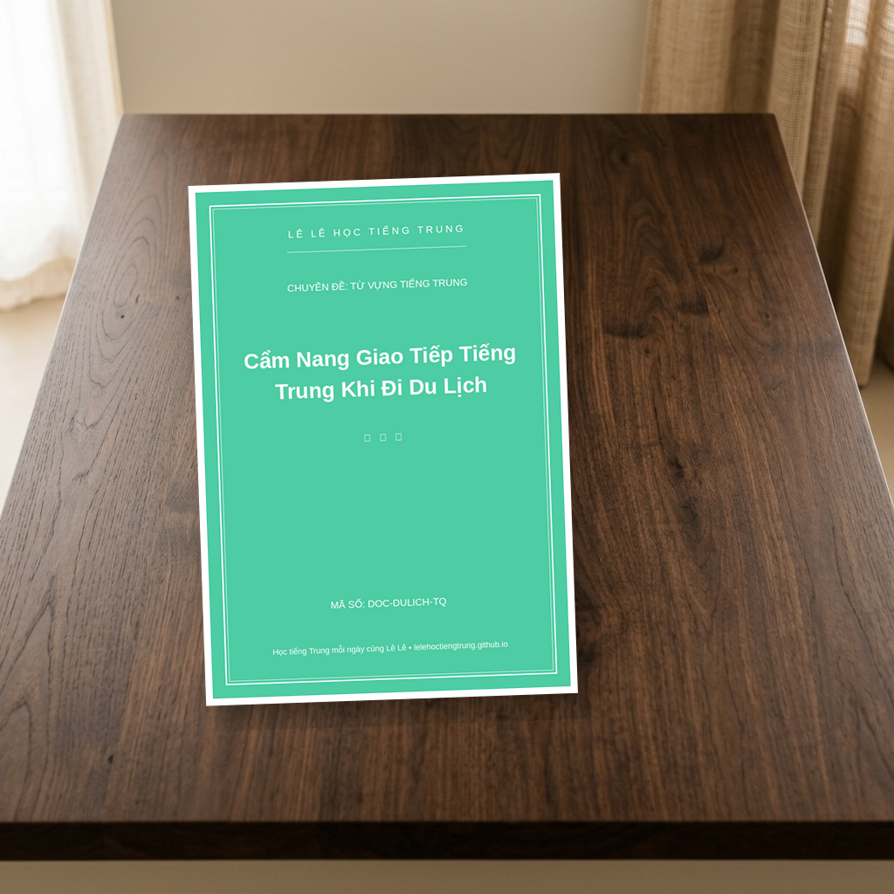

# Cẩm nang giao tiếp du lịch Trung Quốc
**ID/SKU**: DOC-DULICH-TQ
**Phù hợp với**: Người chuẩn bị đi du lịch Trung Quốc tự túc | Người mới học tiếng Trung muốn học ứng dụng thực tế | Những bạn muốn tích lũy vốn từ vựng về đời sống nhanh chóng

## Giới thiệu tài liệu:
# NI HAO! CÙNG LÊ LÊ VI VU TRUNG QUỐC VỚI BỘ CẨM NANG SIÊU XỊN SÒ! 🇨🇳✈️

Chào các bạn! Lê Lê đây! Có phải các bạn đang ấp ủ một chuyến du lịch đến "đất nước tỷ dân", muốn check-in tại Vạn Lý Trường Thành hay thưởng thức lẩu Haidilao chính gốc mà còn đang "rét" vì sợ không biết nói tiếng Trung không? Đừng lo nhé, vì Lê Lê đã ở đây và mang đến cho các bạn một món quà cực kỳ đặc biệt: **Cẩm nang giao tiếp du lịch Trung Quốc**!

Tài liệu này không chỉ là những từ vựng khô khan đâu, mà là "bí kíp bỏ túi" giúp bạn tự tin từ lúc xuống sân bay cho đến khi tung tăng mua sắm tại các khu chợ sầm uất. Cùng Lê Lê khám phá xem bên trong có gì nhé!

### 📋 Cấu trúc tài liệu có gì đặc biệt?
Cẩm nang được chia thành các chủ đề cực kỳ logic và dễ tra cứu, giúp bạn ứng phó trong mọi tình huống:
1. **Thủ tục Sân bay & Nhập cảnh:** Những câu hỏi thường gặp của hải quan và cách trả lời "chuẩn không cần chỉnh".
2. **Di chuyển (Tàu cao tốc, Taxi, Bus):** Cách hỏi đường, đặt vé và sử dụng các ứng dụng di chuyển thần thánh.
3. **Lưu trú (Khách sạn/Airbnb):** Các mẫu câu check-in, check-out và yêu cầu dịch vụ phòng.
4. **Thiên đường ẩm thực:** Cách gọi món, hỏi giá và những từ khóa về khẩu vị (cay, không cay, không cho rau thơm...).
5. **Mua sắm & Mặc cả:** Tuyệt chiêu trả giá để không bị "hớ" và những câu khen ngợi lấy lòng người bán hàng.

### 📸 Ảnh minh họa bên trong tài liệu

### 📥 Tải tài liệu ngay tại đây:
Các bạn hãy click vào link bên dưới để sở hữu bộ cẩm nang siêu chất này hoàn toàn miễn phí nhé. Đừng quên lưu về điện thoại để mang theo bên mình suốt chuyến đi nha!
👉 [Link Download Tài Liệu](https://drive.google.com/drive/folders/1K04CiMYUBOfScPA3E8QrlavUOjNI874b)

Chúc các bạn có một chuyến đi thật rực rỡ, ăn thật ngon và nói tiếng Trung "vèo vèo" cùng người bản địa nha! Yêu các bạn rất nhiều! ❤️

## Đường dẫn tải tài liệu (Google Drive):
👉 **[Tải xuống PDF Cẩm nang giao tiếp du lịch Trung Quốc](https://drive.google.com/drive/folders/1K04CiMYUBOfScPA3E8QrlavUOjNI874b)**

## Điểm nổi bật (Pros):
- Chủ đề thực tế, sát với đời sống du lịch
- Có đầy đủ Pinyin và âm bồi hỗ trợ
- Hình ảnh minh họa sinh động, bắt mắt
- Định dạng tối ưu để xem trên điện thoại hoặc in ấn

## Phương pháp học tập (Tips):
- Chỉ tập trung vào giao tiếp ngắn, không dạy sâu về ngữ pháp
- Cần biết qua về phát âm cơ bản để đạt hiệu quả tốt nhất
