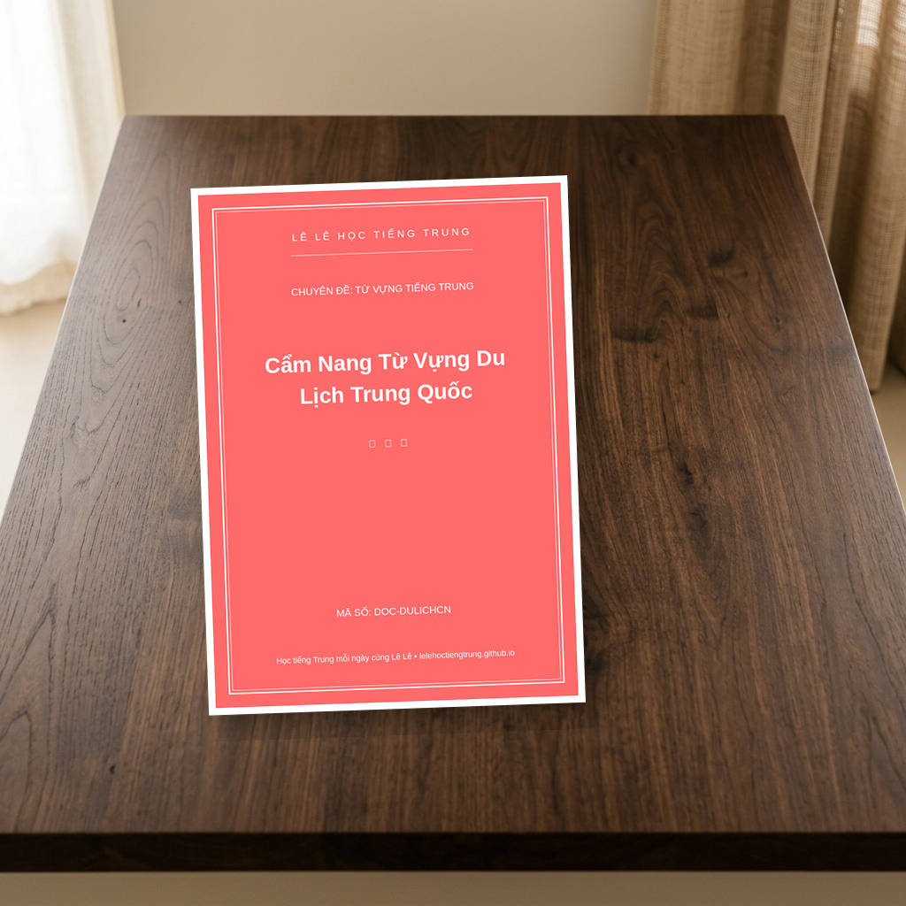

# Cẩm Nang Từ Vựng Du Lịch Trung Quốc
**ID/SKU**: DOC-DULICHCN
**Phù hợp với**: Các bạn chuẩn bị đi du lịch, công tác ngắn ngày tại Trung Quốc, hoặc người mới bắt đầu học tiếng Trung muốn trang bị ngay vốn từ vựng giao tiếp thực tế.

## Giới thiệu tài liệu:
Chào các bạn! Lê Lê đây! 👋

Mùa du lịch đến rồi, có bạn nào đang ấp ủ dự định vi vu đất nước tỷ dân không nhỉ? Từ việc thưởng thức những món ăn đường phố cay nồng hấp dẫn, ngắm nhìn phong cảnh thiên nhiên hùng vĩ, cho đến những màn "chốt đơn" cháy máy tại các khu chợ sầm uất... Nghĩ đến thôi là Lê Lê đã thấy háo hức thay các bạn rồi! 😍

Tuy nhiên, Lê Lê biết rào cản ngôn ngữ luôn là nỗi lo lắng lớn nhất của chúng mình khi đi du lịch nước ngoài. Đừng quá lo lắng nhé, vì Lê Lê đã cất công biên soạn riêng cho các bạn cuốn **Cẩm Nang Từ Vựng Du Lịch Trung Quốc** cực kỳ xịn xò này đây! 

### 📖 Cấu trúc tài liệu có gì hấp dẫn?
Cuốn cẩm nang được Lê Lê thiết kế vô cùng logic, bám sát hành trình của một chuyến du lịch thực tế. Các bạn sẽ không phải học lan man mà đi thẳng vào những tình huống chắc chắn sẽ gặp phải:
- ✈️ **Trạm 1: Sân bay & Nhập cảnh:** Các từ vựng về giấy tờ, thủ tục, ký gửi hành lý.
- 🏨 **Trạm 2: Khách sạn & Chỗ ở:** Cách check-in, check-out, và yêu cầu thêm dịch vụ phòng.
- 🍜 **Trạm 3: Ăn uống sập phố:** Tên các món ăn phổ biến, cách gọi món, dặn dò khẩu vị (ít cay, không hành...) và thanh toán.
- 🛍️ **Trạm 4: Mua sắm & Trả giá:** Cẩm nang thần chú giúp bạn "mặc cả" thành công mà không sợ bị hớ!
- 🆘 **Trạm 5: Hỏi đường & Xử lý tình huống khẩn cấp:** Rất quan trọng để bảo vệ bản thân khi ở nơi đất khách quê người.

Mỗi từ vựng đều có sẵn chữ Hán, Pinyin, nghĩa tiếng Việt và cả những câu giao tiếp mẫu ngắn gọn để các bạn "ốp" thẳng vào thực tế luôn nha!

### 🖼️ Ảnh minh họa bên trong tài liệu
Dưới đây là một vài hình ảnh "nhá hàng" sương sương về độ đáng yêu và dễ nhìn của em nó nè:

### 📥 Tải xuống tài liệu ngay thôi!
Các bạn nhớ tải về, lưu vào điện thoại hoặc in ra thành một cuốn sổ tay nhỏ mang theo bên mình nhé. Nó sẽ là "bùa hộ mệnh" cực kỳ đắc lực cho chuyến đi của các bạn đấy!

👉 **[Tải xuống tài liệu tại đây](https://drive.google.com/drive/folders/13z19SN0Cd0XpF6UV251yJjMorFNuQw2a)**

Chúc các bạn có một chuyến du lịch Trung Quốc thật vui vẻ, an toàn và có những trải nghiệm tuyệt vời! Nhớ chụp thật nhiều ảnh đẹp và khoe với Lê Lê nha! Hẹn gặp lại các bạn trong những tài liệu thú vị tiếp theo! ❤️

## Đường dẫn tải tài liệu (Google Drive):
👉 **[Tải xuống PDF Cẩm Nang Từ Vựng Du Lịch Trung Quốc](https://drive.google.com/drive/folders/13z19SN0Cd0XpF6UV251yJjMorFNuQw2a)**

## Điểm nổi bật (Pros):
- Từ vựng bám sát các tình huống du lịch thực tế 100%
- Có sẵn Pinyin và câu giao tiếp mẫu cực ngắn gọn
- Thiết kế màu sắc sinh động, trực quan, dễ tra cứu
- Định dạng tối ưu để in ấn thành sổ tay mang theo

## Phương pháp học tập (Tips):
- Chỉ tập trung vào giao tiếp cấp tốc, không dạy sâu về ngữ pháp
- Cần chủ động nghe file audio ngoài hoặc nắm cơ bản về Pinyin để phát âm chuẩn
