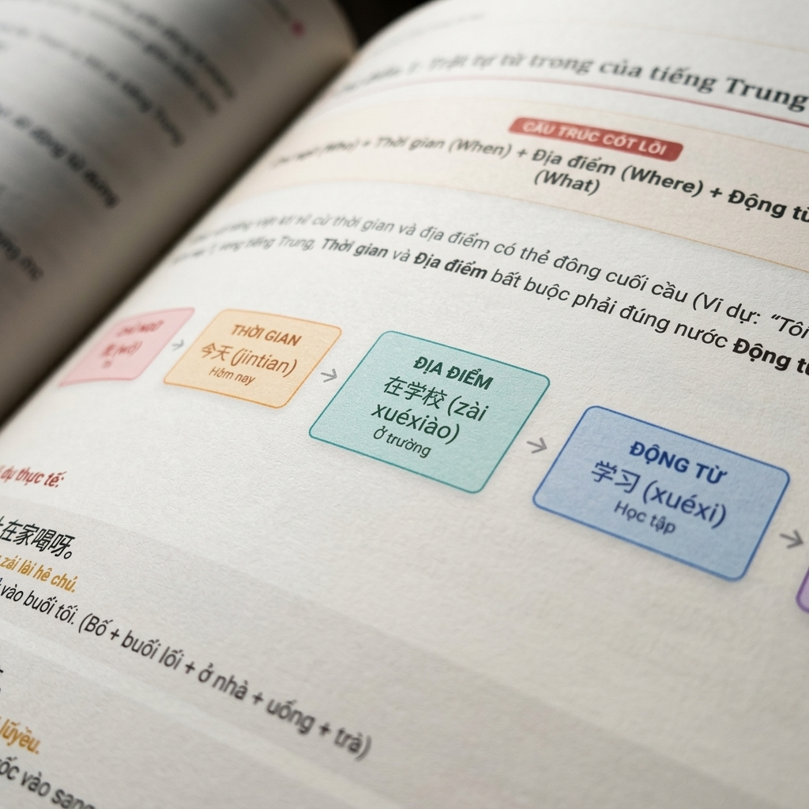
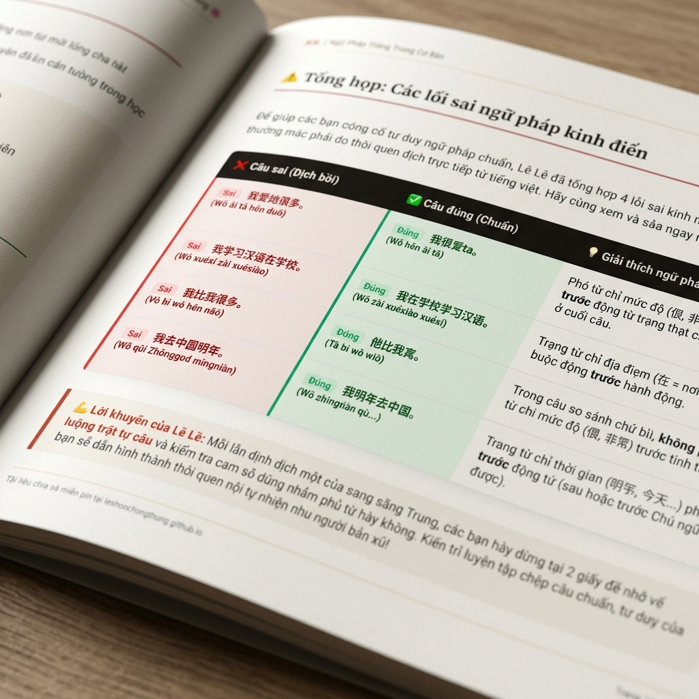

# Ngữ Pháp Tiếng Trung Cơ Bản
**ID/SKU**: DOC-GRAMMAR
**Phù hợp với**: Các bạn muốn củng cố tư duy ngữ pháp chuẩn, khắc phục lỗi nói tiếng Trung bồi, chuẩn bị ôn thi HSK 2-3.

## Giới thiệu tài liệu:
Chào các bạn! Lê Lê đây. Hôm nay mình chia sẻ cho các bạn cuốn sổ tay **Ngữ Pháp Tiếng Trung Cơ Bản**. Một trong những khó khăn lớn nhất của các bạn khi mới bắt đầu học tiếng Trung là làm sao nói được câu dài hoàn chỉnh mà không bị ngập ngừng, nói "bồi", hay dịch word-by-word trực tiếp từ tiếng Việt sang.

Cuốn tài liệu này chính là "bảo bối" giúp các bạn hệ thống hoá toàn bộ các cấu trúc cơ bản từ câu đơn, câu phức, cách dùng các phó từ phổ biến cho đến các trợ từ động thái. Toàn bộ kiến thức được mình chuyển hóa dưới dạng **sơ đồ trực quan (infographics và mindmaps)** sinh động, kết hợp với các ví dụ thực tế được dịch nghĩa chi tiết. Học ngữ pháp qua sơ đồ sẽ giúp não bộ của chúng ta nhớ lâu hơn gấp nhiều lần so với việc đọc các trang chữ lý thuyết khô khan! Cố lên nhé các bạn cùng học!

## Ảnh minh họa bên trong tài liệu:
Dưới đây là một số hình ảnh xem trước thực tế dạng 3D chéo góc của cuốn sổ tay để các bạn tham khảo:

| Sơ đồ cấu trúc câu S + T + P + V + O (Trang 3) | Bảng phân tích lỗi sai ngữ pháp kinh điển (Trang 10) |
|:---:|:---:|
|  |  |

## Đường dẫn tải tài liệu (Google Drive):
Các bạn có thể tải bản PDF chất lượng cao để in ấn tại đây:
👉 **[Tải xuống PDF Ngữ Pháp Tiếng Trung Cơ Bản](https://drive.google.com/drive/u/0/folders/1XdzdpnxPyPHp2PnEyIOPUnSwlTcIeTeN)** (Chọn thư mục `DOC-GRAMMAR`)

## Điểm nổi bật (Pros):
- Trình bày trực quan 100% bằng infographics & mindmaps màu sắc bắt mắt.
- Giải thích cấu trúc ngữ pháp rõ ràng, phân tích sâu các ví dụ thực tế đi kèm.
- Có bảng phân tích và "sửa lưng" các lỗi sai ngữ pháp kinh điển của người Việt khi học tiếng Trung.
- Thiết kế A4 tối giản, tông màu tối ấm sang trọng, in màu cực kỳ đẹp.

## Phương pháp học tập (Tips):
- **Học đi đôi với hành**: Học xong cấu trúc nào, hãy tự đặt ít nhất 3 ví dụ liên quan trực tiếp đến cuộc sống của mình nhé.
- **Tập viết tay câu ví dụ**: Chép tay cả chữ Hán và Pinyin ra vở để kích hoạt trí nhớ cơ bắp.
- **Nói to thành tiếng**: Luyện đọc to các câu ví dụ lên để hình thành phản xạ nói tự nhiên, trôi chảy.
