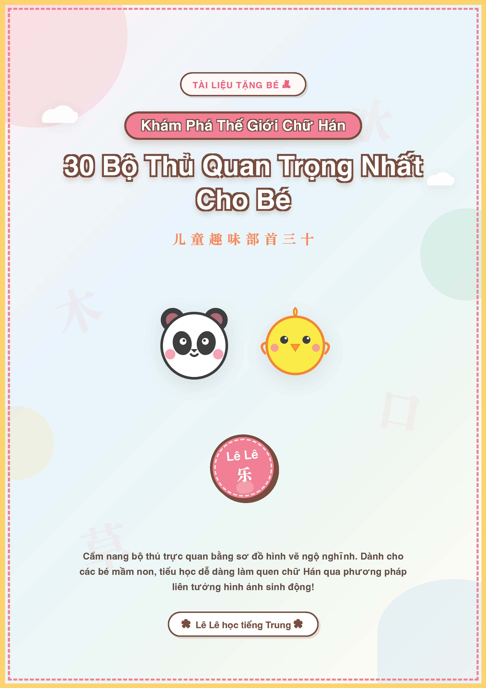
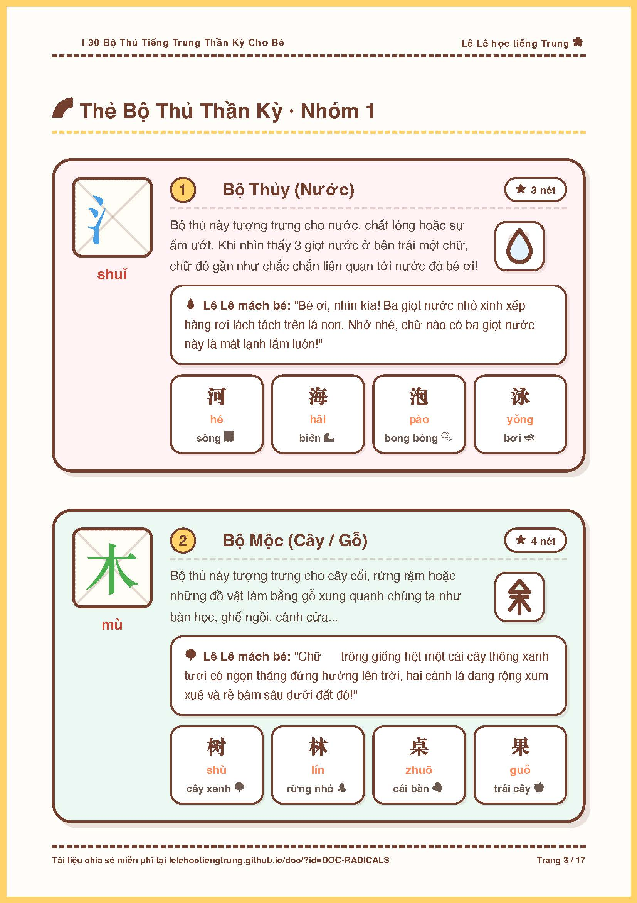
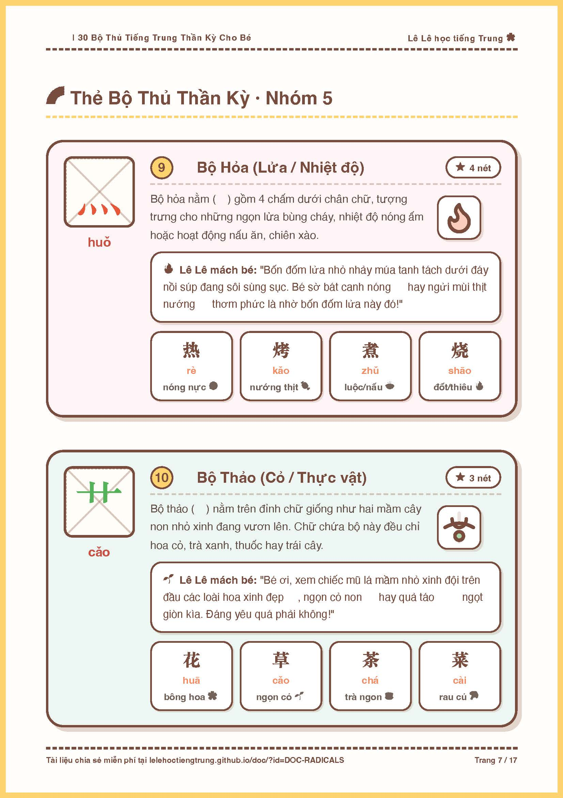

# 30 Bộ Thủ Tiếng Trung Thần Kỳ Cho Bé
**ID/SKU**: DOC-RADICALS
**Phù hợp với**: Dành cho các bé mầm non, học sinh tiểu học mới bắt đầu làm quen với chữ Hán, hoặc phụ huynh/giáo viên muốn dạy chữ Hán trực quan cho trẻ nhỏ.

## Giới thiệu tài liệu:
Chào các phụ huynh và các bé! Lê Lê đây. Trong hành trình chinh phục tiếng Trung, việc ghi nhớ mặt chữ tượng hình luôn là thử thách lớn nhất đối với các bạn nhỏ. Chữ Hán không phải là các ký tự biểu âm mà được ghép lại từ các nét vẽ và bộ thủ - giống như những mảnh ghép lego kỳ diệu.

Để giúp các bé tiếp cận chữ Hán một cách tự nhiên và thú vị nhất, mình đã biên soạn tập tài liệu **30 Bộ Thủ Tiếng Trung Thần Kỳ Cho Bé**. Bộ tài liệu được thiết kế hoàn toàn theo phong cách trẻ em: sử dụng tông màu Pastel tươi sáng dịu mát, các hình vẽ minh họa SVG vô cùng ngộ nghĩnh mô tả sự liên tưởng hình ảnh của chữ (Ví dụ: bộ Thủy là 3 giọt nước chảy, bộ Mộc là một cái cây xanh tốt,...). Mỗi thẻ bộ thủ đều đi kèm ô Mễ Tự cỡ lớn nét mờ để bé tập tô nét chuẩn, kèm theo bóng hội thoại gần gũi và bảng 3-4 từ vựng thông dụng dễ thương. Đây chắc chắn là cẩm nang học tập tuyệt vời biến việc học chữ Hán thành trò chơi khám phá hấp dẫn cho bé!

## Ảnh minh họa bên trong tài liệu:
Dưới đây là một số hình ảnh xem trước các trang thiết kế thực tế bên trong tài liệu:

| Thẻ bộ thủ 1 & 2 (Trang 3) | Thẻ bộ thủ 9 & 10 (Trang 7) |
|:---:|:---:|
|  |  |

## Đường dẫn tải tài liệu (Google Drive):
Các bạn có thể tải bản PDF chất lượng cao để in màu sắc nét tại đây:
👉 **[Tải xuống PDF 30 Bộ Thủ Tiếng Trung Thần Kỳ Cho Bé](https://drive.google.com/file/d/1KF_c7CHdSljkl8Rme-C5LZpI0h9XMRAE/view?usp=sharing)**

## Điểm nổi bật (Pros):
- Thiết kế tông màu Pastel xinh xắn, thu hút trẻ nhỏ học tập.
- Hình vẽ minh họa ngộ nghĩnh, giúp bé học qua phương pháp liên tưởng thị giác vô cùng dễ nhớ.
- Bong bóng hội thoại "Lê Lê mách bé..." giải thích chữ dễ hiểu, thân thương.
- Ô ly Mễ Tự cực lớn nét mờ hỗ trợ bé tập tô bút màu đều đẹp.
- Cung cấp từ vựng đi kèm gần gũi, kèm emoji sinh động.

## Phương pháp học tập (Tips):
- **Xem tranh liên tưởng**: Cho bé ngắm hình vẽ minh họa trước để con hình dung hình ảnh thực tế của bộ thủ ngoài đời.
- **Kể truyện cho bé**: Ba mẹ đọc to lời thoại dễ thương trong ô "Lê Lê mách bé" để gợi mở tư duy cho con.
- **Tô màu sáng tạo**: Cho bé dùng nhiều màu sáp/màu dạ tô đè lên chữ nét mờ trong ô ly.
- **Chơi trò chơi đố chữ**: In và cắt rời từng bộ thủ làm thẻ Flashcard để ba mẹ cùng bé ôn tập, đố vui nhận diện chữ Hán hàng ngày nhé!
