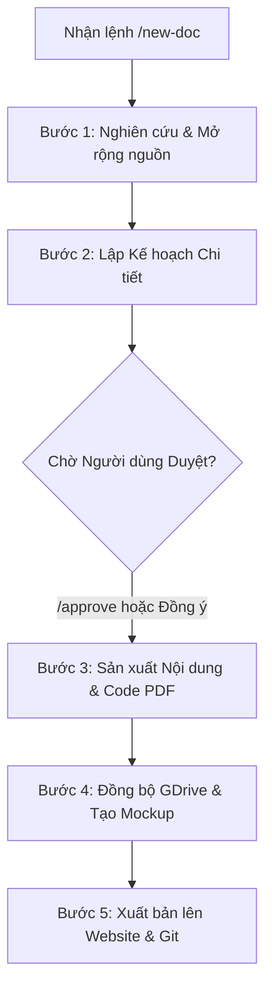

# Quy ước & Cú pháp Tự động hóa Quy trình Sản xuất Tài liệu (A-Z Workflow)

Tài liệu này định nghĩa hệ thống lệnh viết tắt và quy trình chuẩn giúp bạn dễ dàng ra lệnh cho AI thực hiện từ khâu **nghiên cứu kiến thức -> viết mã tạo PDF -> thiết kế mockup -> đồng bộ GDrive -> xuất bản bài viết** trực tiếp từ chat hoặc CLI.

---

## 1. Cú pháp Lệnh (Commands Syntax)

Mỗi khi muốn sản xuất tài liệu mới, bạn chỉ cần gửi yêu cầu sử dụng một trong các cú pháp dưới đây:

### Cú pháp Rút gọn (Gọn gàng trong Chat)
```text
/new-doc
SKU: [Mã SKU, VD: DOC-HSK4]
Tiêu đề: [Tên tài liệu]
Nguồn: [Link 1, Link 2 hoặc đính kèm tài liệu]
Mô tả: [Định hướng nội dung hoặc đối tượng hướng đến]
Mở rộng nguồn: [Có/Không] (Cho phép AI tìm thêm các nguồn bổ sung bên ngoài)
```

### Cú pháp CLI (Dành cho dòng lệnh)
```bash
antigravity /new-doc --sku "DOC-XYZ" --title "Tiêu đề" --sources "https://link1.com, https://link2.com" --desc "Mô tả nội dung" --expand
```

---

## 2. Quy trình Thực hiện Tự động của AI (A-Z Workflow)

Khi nhận được lệnh, AI sẽ tự động kích hoạt quy trình 5 bước khép kín dưới đây:



### 📋 Bước 1: Nghiên cứu Kiến thức & Đề xuất Nguồn (Research)
- **Đọc nguồn gửi đến**: AI sẽ dùng công cụ duyệt web để đọc và trích xuất toàn bộ kiến thức cốt lõi từ các link bạn gửi.
- **Mở rộng nguồn (nếu có)**: Tìm kiếm thêm 3-5 tài liệu uy tín từ các nguồn chính thống (nếu bạn cho phép).
- **Trình nguồn**: AI sẽ liệt kê rõ ràng danh sách nguồn tham khảo cùng tóm tắt kiến thức thu hoạch được để bạn duyệt trước khi thiết kế.

### 📋 Bước 2: Lập Kế hoạch Chi tiết (Implementation Plan)
AI tự động tạo `implementation_plan.md` mô tả chi tiết:
- **Cấu trúc tài liệu PDF**: Tổng số trang, mục lục từng trang, phong cách thiết kế bìa (lấy tông màu thương hiệu của website làm chủ đạo).
- **Layout Infographics/Mindmap**: Đề xuất các trang đồ họa trực quan (ví dụ: Trang 3 vẽ cấu trúc ngữ pháp gì, Trang 5 so sánh lỗi sai thế nào).
- **Yêu cầu phản hồi**: Set trạng thái chờ duyệt.

### 📋 Bước 3: Sản xuất Nội dung & Code PDF (A-Z Production)
Sau khi bạn gõ `/approve` hoặc phản hồi đồng ý, AI sẽ:
- **Viết mã tạo PDF**: Tạo file `scripts/generate_[sku]_pdf.py` chứa mã HTML/CSS và Python ReportLab/Weasyprint để kết xuất ra PDF chất lượng cao.
- **Trích xuất trang & Tạo mockup**: Tạo file `scripts/extract_[sku]_pages.py` để chụp ảnh góc chéo 3D nghệ thuật làm ảnh minh họa thực tế cho sách.

### 📋 Bước 4: Đồng bộ hóa GDrive cục bộ
- Tạo thư mục con tương ứng với SKU trên Google Drive cục bộ của bạn thông qua script tự động hóa:
  ```bash
  python3 scripts/sync_to_gdrive.py --sku [SKU]
  ```
- Di chuyển PDF và hình ảnh mockup sang Google Drive cục bộ để client tự động đồng bộ lên cloud.

### 📋 Bước 5: Viết Bài giới thiệu & Đẩy lên Website
- **Viết bài giới thiệu**: Tạo file giới thiệu Markdown tại `POSTS/docs/[SKU].md` chứa đầy đủ ảnh mockup 3D, ưu/nhược điểm, phương pháp học và link tải Google Drive.
- **Commit và Push**: Đưa toàn bộ mã nguồn và bài viết mới lên Git (nhánh `main`).
- **Sync Sheets (Nếu cần)**: Hướng dẫn bạn chạy đồng bộ hóa trên Google Sheets để dữ liệu lập tức hiển thị trên website.

---

## 3. Quy trình & Cú pháp Đánh giá Sách (Book Review Workflow - `/new-review`)

Quy trình này áp dụng khi bạn muốn tạo bài viết giới thiệu/đánh giá sản phẩm sách học tiếng Trung từ các trang tiếp thị liên kết (Shopee Affiliate):

### Cú pháp Lệnh (Chat Command)
```text
/new-review
Sách: [Tên cuốn sách hoặc Từ khóa tìm kiếm, VD: Giáo trình Boya Sơ Cấp 1]
Shopee Link: [Đường link Shopee VN của sản phẩm nếu có, hoặc để AI tự tìm]
SKU: [Mã SKU, VD: SACH-BOYA-1]
```

### Quy trình Thực hiện của AI (A-Z Review Workflow)

1. **Tìm kiếm & Phân tích thông tin**:
   - **Xử lý Link Shopee**:
     - *Trường hợp 1 (Có link Shopee)*: AI sử dụng trực tiếp link đó để cào thông tin sản phẩm (giá, ảnh, mô tả). Nếu link gửi là link thường (`https://shopee.vn/...`), AI sẽ nhắc bạn đổi sang link affiliate (`https://shope.ee/...`) trước khi xuất bản.
     - *Trường hợp 2 (Không có link Shopee)*: AI sẽ tự động tìm kiếm trên Shopee Việt Nam bằng Google Search để tìm sản phẩm sách chính hãng/được đánh giá tốt nhất, lấy link Shopee gốc và gửi lại cho bạn để bạn chỉ cần convert sang link tiếp thị liên kết cá nhân (Affiliate link) qua Shopee Console.
   - **Nghiên cứu kiến thức**: Nghiên cứu các bài đánh giá, phân tích và chia sẻ kinh nghiệm học cuốn sách này trên các blog học tiếng Trung và mạng xã hội.
   - **Thu thập tài nguyên**: Tìm kiếm và tải xuống hình ảnh chất lượng cao của bìa sách và một số trang nội dung tiêu biểu từ Shopee hoặc internet.
2. **Lập Kế hoạch & Trình duyệt (Proposal)**:
   - Tạo kế hoạch phác thảo bài review, bao gồm các ý chính sẽ đánh giá, đối tượng phù hợp, các điểm mạnh (Pros) và điểm yếu/lưu ý tự học (Cons).
   - Đính kèm link Shopee gốc tìm được để bạn thực hiện convert sang link affiliate.
   - Đề xuất layout mockup và chờ bạn duyệt bằng `/approve`.
3. **Thiết kế Mockup 3D nghệ thuật**:
   - Sử dụng hình ảnh bìa và trang sách thu thập được để tạo mockup sách 3D đặt trên bàn thư viện gỗ và hình ảnh phóng to góc chéo nghệ thuật của các trang nội dung bên trong sách.
   - Lưu trữ các mockup này tại `POSTS/images/`.
4. **Sản xuất bài viết Markdown**:
   - Tạo bài viết tại [POSTS/reviews/](file:///Users/hanario/Documents/YTF-Productions/Lê Lê học tiếng Trung/Website lelehoctiengtrung/POSTS/reviews/) với tên tệp là `[SKU].md`.
   - Bài viết sẽ chứa đầy đủ: Tên sách, SKU, Đối tượng phù hợp, Link mua sách Shopee (Affiliate), các hình ảnh Mockup 3D, phần đánh giá chi tiết nội dung, danh sách Pros/Cons rõ ràng.
5. **Đồng bộ GDrive & Git**:
   - Sao chép toàn bộ hình ảnh mockup và bài viết liên quan vào thư mục Google Drive cục bộ của bạn (`Docs/[SKU]/`) để đồng bộ lên mây.
   - Commit và push bài viết mới lên Git (nhánh `main`).


